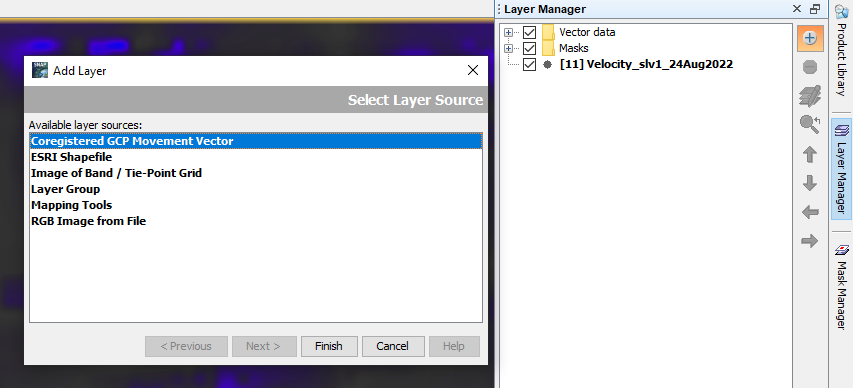
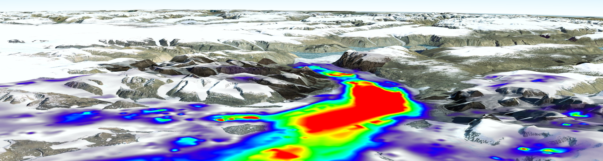

# Sentinel-1 SAR data to visualize glacial movement
Using Sentinel-1 SAR GRD data to visualize glacial movement on Eastern Greenland via SNAP and Google Earth Pro. This repository does not contain any python code and is rather a demonstration of the retrieval and usage of SAR data to visualize iceflow. It generally covers the overarching steps, but does not dwelve into great technical detail on the various steps. This is explained better and in depth from: https://asf.alaska.edu/, which is also where I have found guidance and inspiration for this small project.

## Background

In this project, Sentinel-1 Ground Range Detected products will be used together with offset tracking to quantify the movement between two images, i.e. glacial movement over a period of 12 days. In this case I have targetted glaciers North West of the city of Ittoqqortoormiit (Scoresbysund) on North Eastern Greenland ([Google Earth link](https://www.google.com/maps/@71.1214979,-26.1528196,302840m/data=!3m1!1e3!5m1!1e4))

## 1) Find 2 suitable images and load into SNAP

The images I have found on Copernicus Sci Hub and have the following names:
 * S1A_IW_GRDH_1SDH_20220812T083752_20220812T083817_044517_055004_D3C2
 * S1A_IW_GRDH_1SDH_20220824T083752_20220824T083817_044692_0555F5_334B

As seen in the name they are from the 12th and 24th of August 2022. This is during summer in the Northern Hemisphere and the period where we are likely to see the most glacial surface melting taking place. 

___

## 2) Apply Orbit file
*Menu: Radar -> Apply orbit*

Apply orbit file for each of the images with the standard settings. SNAP will auto acquire the correct information.
 
___

## 3) Coregister the images into a stack using DEM
*Menu: Radar -> Coregistration -> DEM-Assisted coregistration -> DEM Assisted Coregistration with XCorr*

Using the two images as input and a auto acquired DEM, the images will be stacked together. Seen as the standard setting of SRTM3sec does not cover the polar regions, I have used the ACE30 DEM setting instead.

 
____

## 4) Create a subset image
Open one of the bands from the stacked image in the image window and zoom in on the image to "see what you want to crop". Then right click the image and select "Spatial subset from view". This will create a new product with the data cropped down to the area of interest

 
___

## 5) Offset tracking
*Menu: SAR Applications -> Offset Tracking*

Offset tracking can be computing intensive so be aware with large data sets. Offset tracking estimates the movement of the glacier surfaces between the two images. It computes cross-correlation on a selected Ground Contro Point in both images. The glacier velocities on a selected GCP is then computed based on the offsets calculated by the cross/correlation. A velocity map is generated through interpolation of the velocities computed on the GCP grid. See a very good explanation [here](https://asf.alaska.edu/how-to/data-recipes/how-to-create-glacier-velocity-maps-with-sentinel-1-toolbox/) in the Offset Tracking section.
 
 
___

## 6) Generate glacier velocity map
Once the offset tracking is complete, open the finished product by selecting the velocity product and showing it in the image viewer. In the top right corner of SNAP, click the layer manager and add a new layer named "Coregistered GCP Movement Vector. This will add the calculated movement vectors to your image view showing speed and direction

 
___

## 7) Range Doppler Terrain Correction
*Menu: Geometric -> Terrain Correction -> Range Doppler Terrain Correction*

In order to export the project for review in Google Earth, we are going to perform terrain correction. Remember to change the DEM to ACE30 for polar cover.

 
___

## 8) Export KMZ to Google Earth Pro
*Menu: File -> Export -> Other -> View as Google Earth KMZ*
Select the final product and export it as a Google Earth KMZ file. This can be opened up in Google Earth Pro and visualized neatly as seen below

___
